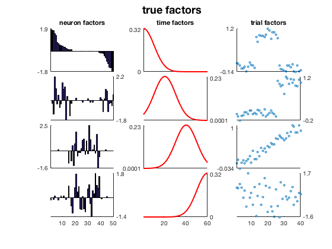
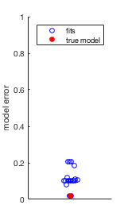

# MATLAB Tutorial

First, download the latest version of the MATLAB [TensorToolbox](http://www.sandia.gov/~tgkolda/TensorToolbox/) developed at Sandia National Laboratories by [Tammy Kolda](http://www.sandia.gov/~tgkolda/) and collaborators. Add it somewhere on your [MATLAB path](https://www.mathworks.com/help/matlab/ref/path.html).

Then, either download this github repo as a zip file, or clone it from the command line:

```
$  git clone https://github.com/ahwillia/tensor-demo.git
```

Open MATLAB and navigate the folder containing this code and run the script `cp_demo` to generate some synthetic data and fit a third-order CP decomposition.

### TL;DR

Looking at the internals of `cp_demo` should give you a basic idea of how to apply CP decomposition to your own data. The essential workflow is embarassingly easy:

```matlab
data = % your 3-D data (neurons x time x trials)
model = cp_als(tensor(data), 10) % fit CP model with 10 components
visualize_neuron_ktensor(model) % produces a nice plot for you
```

As described below, it is a good idea to fit the model multiple times (each call to `cp_als` will start from a different random initial parameter set). Choosing the number of factors/components (4 in the demo, 10 in the example code above) can also require a bit of experimentation.

## Digging into `cp-demo.m`

You can play with various parameters/settings on the synthetic data. As long as noise is low enough, the CP decomposition (fit by alternating least-squares, as reviewed in [Kolda & Bader](http://www.sandia.gov/~tgkolda/pubs/pubfiles/TensorReview.pdf)) should do a pretty good job of estimating the true latent factors:


|  |  |
| --- | --- |

Unlike PCA, CP decomposition cannot be solved in closed form -- instead, the model parameters are optimized from an initial guess. Thus, it is good practice to fit the model from multiple initial conditions, and verify that the final solution isn't too sensitive to the intial guess.

The dotplots below shows the reconstruction error for 30 model fits (blue) and the reconstruction error for the true latent factors (red). In many cases, the CP decomposition is easy to fit (*left panel*) -- this happens when the noise is relatively low and the latent factors are of similar magnitude. In other scenarios (try playing with `lam` so that some factors are more significant than others) the synthetic data is harder to fit (*right panel*). 

| **Data that is easy to fit** | **Data that is more difficult to fit** |
| --- | --- |
|  |  |

Even in the more difficult scenario on the right, some of the initial guesses yield very good, nearly optimal solutions.
